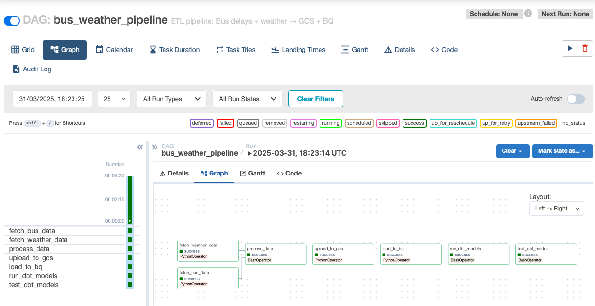
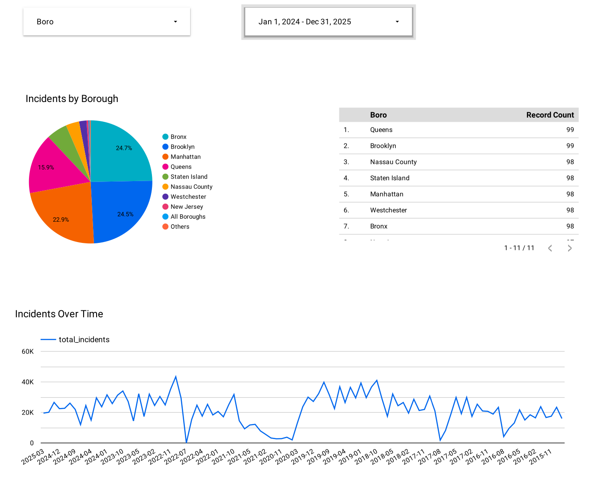

# NYC Bus Delays & Weather Analysis

This project analyzes NYC school bus delay incidents in correlation with weather conditions, using a modern data stack and cloud-native tools.


## 🚌 Project Goal

To build a fully automated, cloud-based data pipeline that:
- Ingests daily bus delay and weather data
- Cleans and processes it using PySpark
- Loads it into BigQuery
- Transforms it with dbt
- Visualizes insights in Looker Studio

## 🧱 Project Structure
```
.
├── airflow/                # Airflow DAGs, Docker setup
├── bus_weather_dbt/        # dbt models, tests, profiles
├── data/                   # Raw and processed data
├── scripts/                # Python scripts (fetching, uploading)
├── spark_jobs/             # Python spark scripts (test, process data)
├── terraform/              # IaC configuration for GCP setup
├── credentials/            # Service account keys (not versioned)
├── notebooks/              # Helper notebook
├── Makefile                # All useful CLI commands
├── README.md               # Project documentation
└── GCP.md                  # Guide to setting up GCP manually or via CLI
```

## 📦 Data Overview

Data Sources
- Bus Delays: NYC Open Data – Daily reports on delays, location, reasons.
- Weather: Open-Meteo API – Hourly weather data based on NYC boroughs.


## 🔧 Project Overview

Technologies Used:
- Airflow: Orchestration
- Spark: Processing
- BigQuery: Data warehouse
- dbt: Modeling & Testing
- Terraform: Infrastructure setup
- Looker Studio: Dashboard


### 📊 Pipeline Steps

1. Fetch raw data from APIs
2. Process and join datasets using PySpark
3. Save processed data as Parquet
4. Upload to GCS and load into BigQuery
5. Use dbt to create analytics models
6. Visualize insights in Looker Studio

### 📈 Architecture Diagram

```plaintext
        +------------+        +-----------+
        |  NYC API   |        | Weather   |
        +------------+        +-----------+
              \                  /
               \                /
                \              /
                 v            v
        +---------------------+
        |  Airflow DAG        |
        |  (ETL Pipeline)     |
        +---------+-----------+
                  |
                  v
        +---------------------+
        |  PySpark Join       |
        +---------+-----------+
                  |
                  v
        +---------------------+
        |   GCS Bucket        |
        +---------+-----------+
                  |
                  v
        +---------------------+
        |   BigQuery (stg)    |
        +---------+-----------+
                  |
                  v
        +---------------------+
        | dbt Transformations |
        +---------+-----------+
                  |
                  v
        +---------------------+
        | Looker Studio       |
        +---------------------+
```


## 📋 Prerequisites

- GCP account with billing enabled
  - See [GCP.md](./GCP.md) for GCP setup instructions (manual + CLI + Terraform).
- Python 3.10+
- Docker & Docker Compose
- [Poetry](https://python-poetry.org/docs/#installation) - [check how to install](#install-poetry)
- [Terraform](https://developer.hashicorp.com/terraform/install)
- [gcloud CLI](https://cloud.google.com/sdk/docs/install) (optional)
- `make` - [check how to install](#install-make)
- `dbt`


## 🚀 Installation & Usage

```bash
# 1. Clone the repo
git clone https://github.com/tomojpin1234/NYC-Bus-Delays-Weather-Analysis.git
cd NYC-Bus-Delays-Weather-Analysis

# 2. Initial setup
make init

# 3. Setup GCP (next steps require GCP) more in GCP.md

# 4. Set up GCP resources
make tf-init
make tf-apply

# 5. Build and run Airflow
make airflow-init
make airflow-up         
# wait ~30s and open the browser - this will mean the airflow is ready
make airflow-trigger    # trigger the DAG
# check the pipeline in Airflow UI

# 6. (Optional) Install dependencies
make setup

# 7. (Optional) Run dbt manually
make dbt-run-full
make dbt-test

# Note: the flow was tested on macOS with Intel and Apple silicon
```

> The full pipeline can be triggered from the Airflow UI at `http://localhost:8080` Username: airflow, password: airflow
> Once triggered, Airflow UI should look like this


## ✅ Reproducibility

Use the `Makefile` to run everything:

```bash
make airflow-up         # Start Airflow
make airflow-trigger    # Trigger pipeline
make dbt-run-full       # Run all dbt models
make dbt-test           # Run dbt tests
make tf-apply           # Provision GCP infra
```

## 📊 Dashboard

- Built in **Looker Studio**
- Uses final tables from `mart_*` dbt models

**Includes:**
- Number of incidents by borough
- Time-series of delays
- Average delay by weather conditions
- Delay status breakdown (Delayed vs No Delay)

🔗 Dashboard URL: [link-to-looker-studio](https://lookerstudio.google.com/reporting/ce36ae83-cc6c-4090-9c04-f656a4c1e87c)

## 📄 Dashboard Preview

You can [download the PDF preview of the dashboard here](images/dashboard.pdf).




## 📝 How to

### Install Make
#### On Linux
- `make` is usually pre-installed on most Linux distributions.
- If not, you can install it via the package manager:
        - Debian/Ubuntu: `sudo apt install make`
        - Fedora/RHEL/CentOS: `sudo dnf install make` (or `yum` on older versions)
#### On macOS
- `make` is generally included with the Xcode Command Line Tools.
- If it’s missing, install Xcode Command Line Tools by running:        
    
        xcode-select --install

#### On Windows
- Make is not natively available on Windows.
- Options for installing make on Windows include:
  - Git Bash: Install Git for Windows, which includes Git Bash and comes with make. You can run make from Git Bash.
  - Chocolatey: If you use Chocolatey, you can install make with:
            
        choco install make

  - WSL (Windows Subsystem for Linux): Installing WSL allows you to run a Linux environment on Windows, where make can be installed as usual.

After installation, you can verify that make is accessible by running:

        make --version

### GCP Setup
See [`GCP.md`](./GCP.md) for:
- Manual setup via Google Cloud Console UI
- Automated setup via `gcloud` CLI commands + `terraform`        


#### Install Poetry
To install or update Poetry to the latest version, run:

```bash
curl -sSL https://install.python-poetry.org | python3 -
poetry --version
```

After installation, verify the Poetry version:
This project requires **Poetry 2.0.0 or later**.